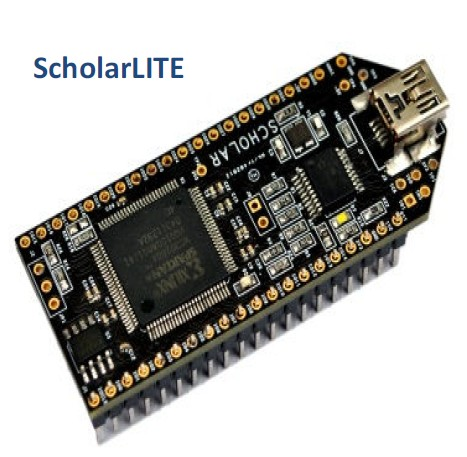
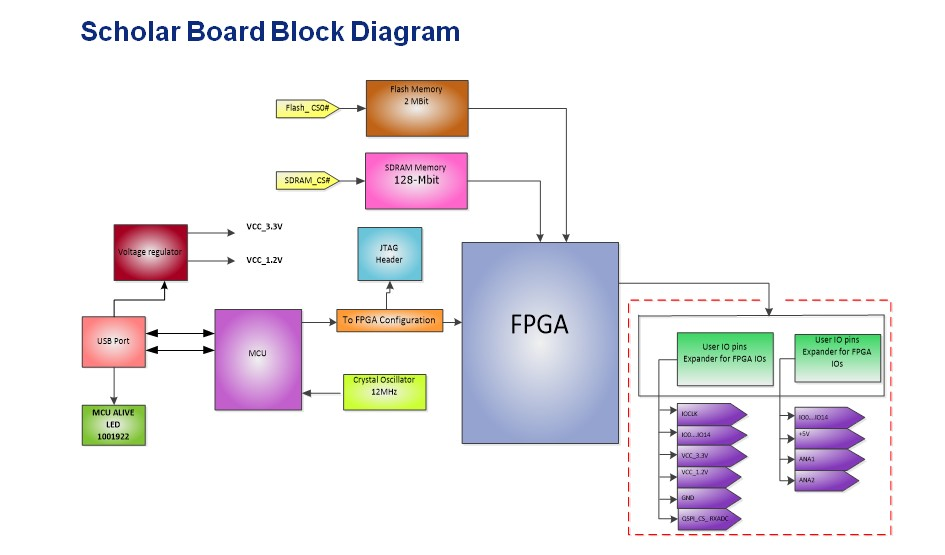
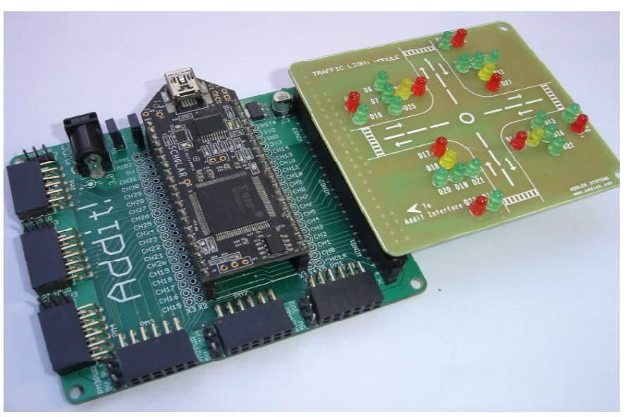

# Modular FPGA Development Board

## Overview
A modular FPGA development board designed for rapid prototyping, embedded-system education, and custom digital-system development.

## Intended Applications
- FPGA education and laboratory training
- Embedded-system prototyping
- Sensor and data-acquisition interfaces
- Digital signal processing experiments
- Robotics and industrial-control prototypes
- Communication-interface development

## Key Features
- FPGA: XC3S200A FPGA
- Clock source: 12 MHz oscillator
- Memory: 8 MByte SDRAM, 2 Mbit Flash
- Interfaces: USB, GPIO, UART, SPI, I2C
- Power input:3.3 & 1.2V regulators
- Expansion modules: Demonstration module: Traffic Light Controller Board

## Project Status
Working prototype completed. Hardware validation and demonstration materials are being organized.

## Documentation
See the [documentation folder](docs/) for the project overview, specifications, block diagram, and testing results.

## Project Images

### FPGA Development Board

### System Block Diagram

### Traffic Light Controller Demonstration

### FPGA Development Flow

## Creator

Designed by Ramakumar Mayil.

